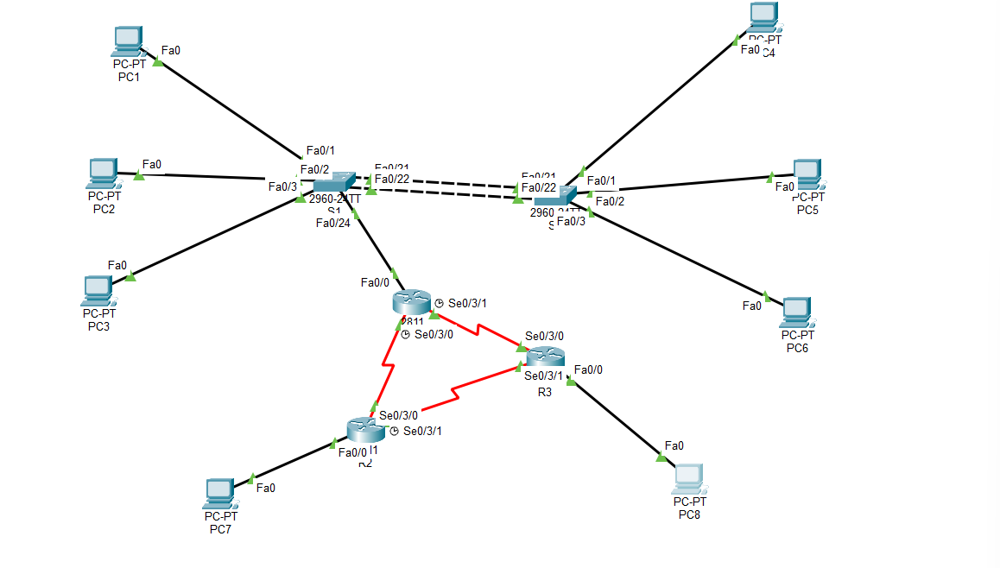

# 🌐 Design & Connectivité WAN : Infrastructure Multisite Segmentée

> **Projet Technique :** Conception et déploiement d'une infrastructure Cisco complète avec segmentation VLAN et routage statique.


## 📌 Présentation du Projet
Ce projet consiste en la création d'un réseau d'entreprise interconnectant un siège social à des entités distantes. L'objectif est de démontrer la maîtrise des technologies de commutation avancée et de routage hybride pour assurer la haute disponibilité et la sécurité des données.

**Étudiant :** Ayman Asghar  
**Encadrant :** Pr. Azeddine Khiat  
**Établissement :** Université Mundiapolis

---

## 🏗️ Topologie & Matériel
L'infrastructure utilise une approche modulaire pour séparer les services et optimiser les performances.
## 🏗️ Topologie du Réseau
![Topologie du réseau]
<p align="center">
  
</p>


### Inventaire des Équipements
| Matériel | Quantité | Rôle Stratégique |
| :--- | :---: | :--- |
| **Routeur Cisco 2811** | 3 | Gestion du cœur de réseau et passerelles WAN. |
| **Switch Cisco 2960** | 2 | Commutation d'accès et distribution (LAN). |
| **PC Clients** | Plusieurs | Postes utilisateurs segmentés par département. |

> [!NOTE]
> La topologie inclut une zone LAN complexe pour le siège et une simulation d'accès distant via des liaisons séries (DCE/DTE).

---

## 🛠️ Schéma d'Adressage IP (VLSM)
Une planification rigoureuse a été appliquée pour éviter les conflits et faciliter l'évolutivité.

| Périphérique | Interface | Adresse IP / Masque | Description |
| :--- | :--- | :--- | :--- |
| **R1** | Fa0/0.10 | 172.18.10.14 /28 | Passerelle VLAN 10 (Compta) |
| **R1** | Fa0/0.60 | 172.18.60.14 /28 | Passerelle VLAN 60 (Admin) |
| **R1** | S0/3/0 | 10.0.30.177 /30 | Lien WAN vers R2 |
| **S2** | Vlan 60 | 172.18.60.2 /28 | IP de Management Switch |

---

## 🚀 Fonctionnalités Déployées

### 1. Commutation de Couche 2 (Switching)
* **Segmentation VLAN** : Division du réseau en 5 domaines de diffusion (10, 20, 30, 50, 60).
* **EtherChannel (LACP)** : Agrégation de liens entre S1 et S2 pour doubler la bande passante et assurer la redondance.
* **IEEE 802.1Q** : Mise en œuvre de Trunks pour le transport multi-VLAN entre les équipements.

### 2. Solutions de Routage (Routing)
* **Router-on-a-Stick** : Communication inter-VLAN via les sous-interfaces du routeur R1.
* **Routage Statique** : Configuration de routes manuelles pour une précision maximale du trafic WAN.
* **Liaisons Séries** : Interconnexion des sites distants avec gestion de la fréquence d'horloge (Clock Rate).

---

## 🔍 Validation du Fonctionnement (Tests)

### Test de Connectivité WAN (Traceroute)
Le test `tracert` confirme que le trafic transite avec succès du siège vers le site distant en passant par les interfaces de routage.

```text
C:\> tracert 10.0.30.129
1    3 ms     0 ms     0 ms     172.18.10.14  (Passerelle R1)
2    0 ms     1 ms     0 ms     10.0.30.129   (Cible Distante)
Trace complete.
